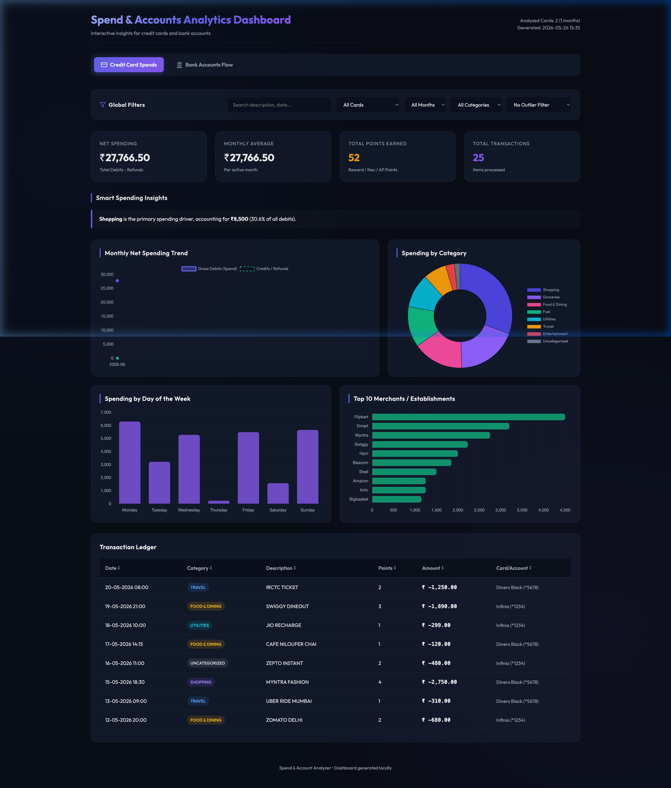

# FinSight Studio 📊



A premium, privacy-first, and fully offline financial analytics suite. It parses Credit Card and Savings/Current Bank Account statements (PDF/CSV) into structured data, generating an interactive **Spend Analytics Dashboard** with high-fidelity visualizations and pluggable AI spending insights.

---

## 🚀 Core Features

*   **🏦 Multi-Format PDF Parser Engine (`parse_statement.py`)**
    *   **HDFC Credit Cards**: Parses premium cards (Infinia, Diners Black, Tata Neu, Regalia Gold, Regalia, Millennia, etc.), extracting merchants, reward/Neu/AP points, and exact transaction times.
    *   **HDFC Savings Accounts**: Parses savings/current account statements, reconstructing running balances and automatically resolving credit/debit sign directions.
    *   **ICICI Credit Cards**: Standardizes transactions, credit indicators (`CR`), and points from popular cards (e.g., Amazon Pay ICICI).
    *   **SBI Savings Accounts**: Parsers for combined SBI account statements, supporting both standard Monthly Statements (Format A) and Custom downloaded statements (Format B).
*   **🔒 Privacy-First Offline Decryption**
    *   Accepts multiple candidate passwords separated by commas or semicolons (e.g., `--password "pwd1;pwd2"`).
    *   Automatically tries each password, along with its uppercase and lowercase permutations.
    *   *100% local processing:* No statements, passwords, or parsed balances ever leave your local machine.
*   **📊 Decoupled Web Architecture**
    *   Clean separation of concerns: Python engine computes structured analytics and saves them to `dashboard_data.json`.
    *   A standalone glassmorphic HTML template (`dashboard.html`) loads, filters, and renders the JSON dataset dynamically.
*   **📈 High-Fidelity Charting (Chart.js)**
    *   **Monthly Outflow Trend**: Interactive line curves for gross spending, cash flows, or income baselines.
    *   **Spend by Category**: High-contrast doughnut breakdown of exact budget distributions.
    *   **Temporal Spikes**: Outlays aggregated by the day of the week.
    *   **Top Merchants**: Horizontal bar charts showcasing your primary consumer channels.
*   **🛠️ Interactive Ledger & Filters**
    *   **Multi-faceted Filters**: Filter on the fly by Card/Account, Month, or Category.
    *   **Full-Text Search**: Instantly match records by description or transaction dates.
    *   **Outlier Exclusion**: Exclude large one-off payments (e.g. > ₹10K, ₹50K, ₹1L) to normalize regular spending trends.
    *   **Click-to-Sort Headers**: Click any header (Date, Category, Description, Points, Amount, Card) to sort ascending or descending.
*   **🤖 Pluggable AI Spending Coach & LLM Enrichment**
    *   **Gemini Merchant Standardizer**: Uses Gemini (defaults to `gemini-3.5-flash`) to automatically extract clean merchant names, counterparties, and standardized categories.
    *   **Smart Spending Coach**: Generates highly personalized financial suggestions, budget alerts, and actionable savings recommendations.
    *   **Zero-Cost Local Cache**: Persists enriched descriptions to `gemini_cache.json` to prevent redundant API calls, protecting your quota and privacy.

---

## 📦 Installation & Setup

FinSight Studio is offline-first and lightweight. The only required dependency is `pypdf` (and `google-genai` if using pluggable AI features).

```bash
pip install pypdf google-genai
```

---

## 💻 Usage Workflows

### 1. Interactive Dashboard (Recommended)

Generate the dashboard from your statements, export the structured dataset, and launch a lightweight web server that automatically opens your default browser.

#### Parse a single PDF statement:
```bash
python generate_dashboard.py \
  --file /path/to/statement.pdf \
  --name "YOUR FULL NAME" \
  --password "PDF_PASSWORD"
```

#### Parse a directory of multiple PDF statements:
```bash
python generate_dashboard.py \
  --dir /path/to/statements/ \
  --name "YOUR FULL NAME" \
  --password "PDF_PASSWORD" \
  --sortformat "%d-%m-%Y"
```

#### Parse a pre-aggregated CSV file:
```bash
python generate_dashboard.py --csv transactions.csv
```

#### Serve an existing pre-computed JSON backup:
```bash
python generate_dashboard.py --json dashboard_data.json
```

#### Options list:
*   `--file <path>`: Path to a single statement PDF.
*   `--dir <path>`: Path to a directory of PDF statements.
*   `--csv <path>`: Path to pre-parsed transaction CSV file.
*   `--json <path>`: Path to an existing pre-computed JSON data file.
*   `--name <name>`: Cardholder name as printed on the statement (required for PDF parsing).
*   `--password <pwd>`: Password string (can list multiple separated by `;` or `,`).
*   `--sortformat <fmt>`: Date pattern in filenames (e.g., `%d-%m-%Y`) to ensure multi-statement batches sort chronologically.
*   `--categories <path>`: Path to custom categories JSON configuration (defaults to `categories.json`).
*   `--cards <path>`: Path to custom card/account mapping JSON file (defaults to `cards.json`).
*   `--output <path>`: Path to save the dashboard HTML file (defaults to `dashboard.html`).
*   `--no-open`: Prevents launching the browser window automatically.
*   `--no-serve`: Disables launching the local HTTP server.
*   `--gemini-key <key>`: Gemini API key to enable AI enrichment and insights. Can also be set via `GEMINI_API_KEY` environment variable.
*   `--gemini-cache <path>`: Path to persistent descriptions cache (defaults to `gemini_cache.json`).
*   `--gemini-model <model>`: Gemini model to invoke (defaults to `gemini-3.5-flash`).

---

### 2. Raw Data Exports & Command Line Summaries

Export transactions directly to standard CSV or print category breakdown summaries directly to your terminal.

#### Export merged transactions to CSV:
```bash
python parse_statement.py \
  --dir /path/to/statements/ \
  --name "YOUR FULL NAME" \
  --password "PDF_PASSWORD" \
  --addheaders > transactions.csv
```

#### Print category breakdowns and statistics to console:
```bash
python parse_statement.py \
  --file /path/to/statement.pdf \
  --name "YOUR FULL NAME" \
  --password "PDF_PASSWORD" \
  --summary \
  --categories categories.json
```

#### Options list:
*   `--addheaders`: Adds a headers row to the top of the CSV output (`Date, Description, Points, Amount, Card`).
*   `--summary`: Outputs a fully formatted terminal statistics panel instead of raw CSV lines.

---

## 🏷️ Custom Categorization Rules

Customize how transaction descriptions map to budget categories by editing `categories.json`. Keyword matching is **case-insensitive**.

```json
{
  "Food & Dining": ["SWIGGY", "ZOMATO", "DOMINOS", "STARBUCKS"],
  "Travel": ["UBER", "OLA", "IRCTC", "MAKEMYTRIP"],
  "Shopping": ["AMAZON", "FLIPKART", "MYNTRA", "AJIO"],
  "Groceries": ["BIGBASKET", "DMART", "BLINKIT", "ZEPTO"]
}
```

---

## 💳 Custom Card & Account Mapping

The engine automatically detects issuers, last 4 digits, and product types (e.g., `HDFC Diners Black (*5678)`). If you want to override or set custom display names, create a `cards.json` file in the root folder:

```json
{
  "1234": "My Primary Infinia",
  "5678": "Regalia Gold Business",
  "9012": "Personal Savings Account",
  "3456": "Amazon Pay ICICI"
}
```

---

## 🛡️ Privacy Commitment

1.  **Offline-First Integrity**: Statement decryption, extraction, balance computation, and HTML visualization happen 100% offline. No details leave your computer.
2.  **Clean String Processing**: Personal indices, city names, reference codes, and transaction IDs are scrubbed locally to generate clean establishment identifiers.
3.  **API Optimization**: All Gemini classifications are cached locally to `gemini_cache.json`. Once descriptions are resolved, zero external API calls are made.
